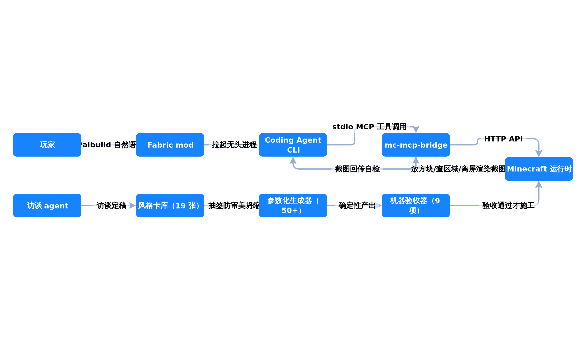

# minecraft-ai-building

把 coding agent CLI（Kimi Code 等）接入 Minecraft：游戏内一句 `/aibuild "盖座塔"`，
AI 自主规划、施工、离屏渲染自检、迭代到验收通过为止。



- 平台：Minecraft Java 1.21.11 + Fabric（单机）
- 架构：游戏内 `/aibuild` 拉起无头 agent；mod 暴露 HTTP API；独立 stdio MCP 桥（`mc-mcp-bridge`）翻译工具调用
- 状态：活跃开发中（当前暂停在树体系大修阶段 3 的检查点，见 `docs/HANDOFF.md`）

## 核心设计原则

**"算得准的全给程序，AI 只做审美决策。"** LLM 的不确定性由确定性代码围住：

- **访谈 agent 先行**：开工前访谈定稿需求（提案制，带约束/自由二选一），需求钉死才施工
- **风格卡 + 抽签器**：19 张风格卡定义审美空间，抽签决定用哪张——治 AI 的"审美坍缩"
  （不抽签时 agent 会反复盖出雷同房子，E9 用预注册统计阈值实锤：同任务组 Jaccard
  相似度 0.729 vs 抽签组 0.561）
- **50+ 参数化生成器**：屋顶/楼梯/巨树/家具等全部确定性 Python（stdlib only），
  AI 填参数不写几何
- **9 项机器验收器**：可行走性/支撑/连通性等硬指标不过就不算完
- **渲染自检闭环**：离屏 GL 渲染截图回传给 agent，多角度对照（单视角会骗人——
  离线评形态必须多角度+纯叶/纯木对照，见 `docs/experiments.md`）
- **快照/undo + 多会话并发**：4 个 agent 并行盖小镇互不干扰

## 实测数字

| 实验 | 结果 |
|---|---|
| E2 单 agent | 16.1 分钟盖完一座庄园 |
| E4 复赛 | 3 agent 25.9 分钟盖完临水小镇 |
| bridge 单测 | 85/85 全绿（mock backend） |
| 规模 | 12 天 89 提交；Java ~1.1 万行 + Python 生成器 ~1.3 万行 + 76 张 JSON 卡 |

## 快速开始

```bash
# 构建 mod（需要 JDK 21）
cd aibuild-mod && ./gradlew build
# 产物 aibuild-mod/build/libs/aibuild-1.0.0.jar → 放进游戏 mods 目录

# bridge 单元测试（不需要游戏）
cd mc-mcp-bridge && ./gradlew test
```

运行需求：Minecraft Java 1.21.11 + Fabric 单机存档；一个 coding agent CLI
（Kimi Code 等）；Python 3（生成器仅用标准库）。agent 模型与额度配置在
`<游戏目录>/aibuild/config.json`。

## 仓库结构

- `aibuild-mod/` — Fabric mod 源码（游戏内命令、HTTP API、离屏渲染管线）
- `mc-mcp-bridge/` — MCP 桥（手写 JSON-RPC 2.0，零 SDK，独立可测）
- `docs/specs/` — 设计文档（[总体设计](docs/specs/2026-07-27-minecraft-ai-building-design.md)、[bridge HTTP API](docs/specs/bridge-http-api.md)、[房屋细节目录](docs/specs/house-detail-catalog.md)）
- `docs/HANDOFF.md` — 跨窗口交接文档（30 秒冷启动恢复，"血泪纪律"清单）
- `docs/experiments.md` — E0–E9 实验记录（含失败复盘与 A/B 统计实验）
- `docs/BACKLOG.md` — 任务积压与重开条件

## English

An in-game coding agent that autonomously plans, builds, and self-inspects Minecraft
structures from a single natural-language command. Key idea: **deterministic code fences
the LLM** — parameterized generators and machine validators handle everything that can be
computed exactly; the AI only makes aesthetic decisions. Custom zero-SDK JSON-RPC/MCP
bridge (85 unit tests), 19 style cards + lottery against mode collapse (A/B-tested with
pre-registered thresholds), offscreen-render self-inspection loop, multi-agent concurrent
builds. Active development; see `docs/HANDOFF.md` for the engineering log.

## License

- **代码**（`aibuild-mod/`、`mc-mcp-bridge/`、生成器脚本）：[AGPLv3](LICENSE)——衍生作品必须同协议开源并署名，网络提供服务同样触发。
- **非代码资产**（`docs/`、风格卡、实验语料、图片）：CC BY-NC-SA 4.0——署名、非商用、相同方式共享。
